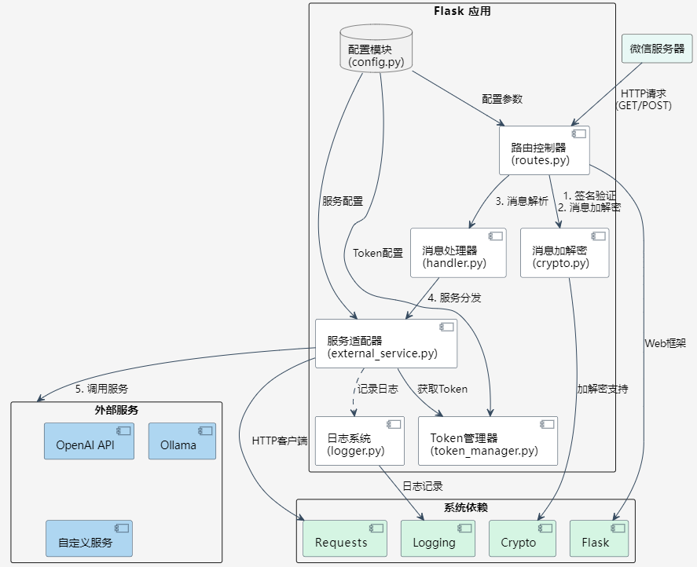
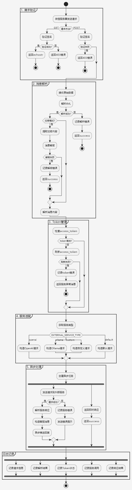

# WeChat Backend Service

基于Flask的微信公众号后端服务，支持消息加解密、异步处理、多服务适配，已实现智能体接入能力。

## 功能特性

### 已实现
- [x] 微信服务器验证（GET/POST）
- [x] 全链路消息加解密（AES-CBC-256安全模式）
- [x] 多服务适配（OpenAI/Ollama/自定义）
- [x] 异步消息处理机制
- [x] 分布式access_token管理
- [x] 服务熔断与重试机制
- [x] 智能体接入框架
- [x] 多级日志系统（文件/控制台）
- [x] Docker容器化部署
- [x] 服务健康监控

### 近期计划
- [ ] 流式消息推送
- [ ] 多模态消息支持
- [ ] 对话上下文管理
- [ ] 服务性能监控面板

## 快速开始

1. 配置环境变量
创建 `.env` 文件并设置以下配置：

```env
# 微信核心配置
WECHAT_TOKEN=your_token
WECHAT_AES_KEY=your_encoding_aes_key
WECHAT_APPID=your_appid
WECHAT_APPSECRET=your_appsecret
# 服务适配配置
EXTERNAL_SERVICE_TYPE=openai # default/openai/ollama/custom
EXTERNAL_SERVICE_URL=http://your-service-endpoint
EXTERNAL_SERVICE_TIMEOUT=600
# 增强配置
TOKEN_FILE_PATH=/app/data/access_token.json
EXTERNAL_SERVICE_TIMEOUT_MSG="请求处理超时，请稍后再试"
EXTERNAL_SERVICE_ERROR_MSG="服务暂时不可用，请稍后重试"
# 日志配置
LOG_LEVEL=DEBUG
LOG_FILE_SIZE=100M
LOG_BACKUP_COUNT=10
```

2. 使用 Docker Compose 启动服务
```bash
docker-compose up -d
# 或
docker-up.sh -d
```

3. 服务将在 5080 端口启动，可通过 `http://your_domain:5080/wechat` 访问

4. 通过[微信公众平台接口调试工具](https://mp.weixin.qq.com/debug/)测试

## 项目结构

```
wx-backend/
├── app/
│ ├── init.py # 应用工厂
│ ├── config.py # 配置基类
│ ├── routes.py # 路由控制器
│ ├── wechat/
│ │ ├── crypto.py # 加解密核心
│ │ ├── handler.py # 消息处理器
│ │ ├── external_service.py # 服务适配器
│ │ └── token_manager.py # Token管理
│ └── utils/
│ └── logger.py # 日志系统
├── tests/ # 测试用例
├── docker/
│ └── entrypoint.sh # 容器入口脚本
├── docker-compose.yml
├── requirements.txt
└── run.py # 启动入口
```

## 框架图



## 流程图



## 配置说明

### 微信公众号配置
- `WECHAT_TOKEN`: 用于验证消息真实性
- `WECHAT_AES_KEY`: 消息加解密密钥
- `WECHAT_APPID`: 公众号的 AppID
- `WECHAT_APPSECRET`: 公众号的 AppSecret

### 服务适配配置
- `EXTERNAL_SERVICE_TYPE`: 外部服务类型，支持以下选项：
  - `default`: 默认HTTP转发模式
  - `openai`: OpenAI API适配
  - `ollama`: Ollama本地模型适配
  - `custom`: 自定义服务适配
- `EXTERNAL_SERVICE_URL`: 外部服务接口地址
- `EXTERNAL_SERVICE_TIMEOUT`: 请求超时时间（秒）

### 增强配置
- `TOKEN_FILE_PATH`: access_token存储路径
- `EXTERNAL_SERVICE_TIMEOUT_MSG`: 超时提示消息
- `EXTERNAL_SERVICE_ERROR_MSG`: 服务异常提示消息

### 日志配置
- `LOG_LEVEL`: 日志级别（DEBUG/INFO/WARNING/ERROR）
- `LOG_FILE_SIZE`: 单个日志文件大小限制（如：100M）
- `LOG_BACKUP_COUNT`: 日志文件备份数量
- `LOG_DIR`: 日志存储目录（默认：/app/logs）

## 开发计划

1. 第一阶段（已完成）
   - 基础消息收发功能
   - 安全模式下的消息加解密
   - 日志系统
   - Docker 部署

2. 第二阶段（已完成）
   - access_token 管理
   - 消息推送功能
   - 更多类型消息支持

3. 第三阶段（进行中）
   - 智能体接入
   - 自定义菜单
   - 用户管理

## 注意事项

1. 安全性
   - 所有配置信息都通过环境变量注入
   - 支持安全模式下的消息加解密
   - 日志系统避免敏感信息泄露

2. 部署
   - 推荐使用 Docker Compose 部署
   - 需要配置 URL（微信服务器要求）
   - 建议使用反向代理（如 Nginx）

## 贡献指南

欢迎提交 Issue 和 Pull Request。在提交代码前，请确保：
1. 代码风格符合 PEP 8 规范
2. 添加必要的注释和文档
3. 更新 README 中的功能列表

## License

MIT License